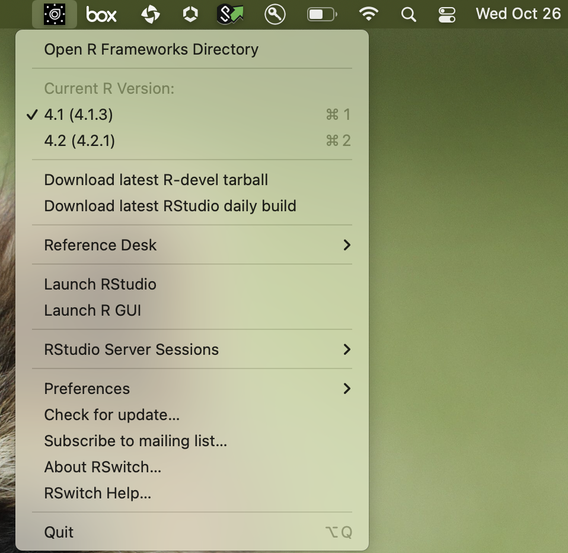

```{r setup, include=FALSE, cache = F}
knitr::opts_chunk$set(echo = TRUE)
library(tidyverse)
```

Whenever there is new release of R at CRAN, I am always tempted to install the new version so that I can use the fancy new tools. However, switch to new version of R is always a pain if most of the work is dependent on the packages installed under old version. It takes time to re-install all the packages under new R version. It motivates me to install multiple versions of R in OS so that I have freedom to choose which one as active.

It is not too bad to install multiple versions under Linux OS, especially under different conda environments. However, in MacOS, the GUI installer will automatically delete old version executable and leave incomplete R framework. In this post, I will show step-by-step how to install multiple versions of R under MacOS, and switch versions of R in Rstudio.

Mac, by default, save R executable and relevant libraries at `/Library/Frameworks/R.framework/Versions/`. Here is the tree structure of my "R.framework" (`tree -L 3 /Library/Frameworks/R.framework`)

```{bash eval=F}
    /Library/Frameworks/R.framework
    ├── Headers -> Versions/Current/Headers
    ├── Libraries -> Versions/Current/Resources/lib
    ├── PrivateHeaders -> Versions/Current/PrivateHeaders
    ├── R -> Versions/Current/R
    ├── Resources -> Versions/Current/Resources
    └── Versions
        ├── 4.1
        │   ├── Headers -> Resources/include
        │   ├── PrivateHeaders
        │   ├── R -> Resources/lib/libR.dylib
        │   └── Resources
        └── Current -> /Library/Frameworks/R.framework/Versions/4.1
```

-   The R package libraries were saved under `Resources/library`

-   R which is symbolic linked to `Resources/lib/libR.dylib` is the executable.

Usually, if you just download new version binary installer (`*.pkg`) from [CRAN](https://cran.r-project.org/) and use GUI to install, it will 1) remove the original executable, 2) symbolic link `Current` to the new version.

## 1. Get source package

get source package from https://mac.r-project.org/

```{bash eval=F}
# download source
 curl -O https://mac.r-project.org/high-sierra/R-4.2-branch/x86_64/R-4.2-branch.tar.gz

# extract to folder 4.2
mkdir -p 4.2/
tar xfzv R-4.2-branch.tar.gz --directory 4.2
```

## 2. Move to `R.framework` destination

move to destination folder Inside 4.2 folder will be very similar to mac structure `Library/Frameworks/R.framework/Versions/4.2`, thus copy it to mac default R folder `/Library/Frameworks/R.framework/Versions/4.2`

```{bash eval=F}
# rm -rf /Library/Frameworks/R.framework/Versions/4.2
cp -R Library/Frameworks/R.framework/Versions/4.2 /Library/Frameworks/R.framework/Versions/
```

## 3. Rswitch

[Rswitch](https://rud.is/rswitch/) is a light-weight utility for macOS R users, which can help easily switch active R version. It basically re-establish symbolic link of `Current` mentioned above to the version you selected.

After installation and open, Rswitch shows as a little control panel at right corner of top menu.

{width="50%"}

## 4. Use different version of R in Rstudio

Before opening Rstudio, select the version you want at Rswitch. When you click the Rstudio app or R project, the Rstudio will automatically recognize the right R version to use from Console.

Happy R switch!
